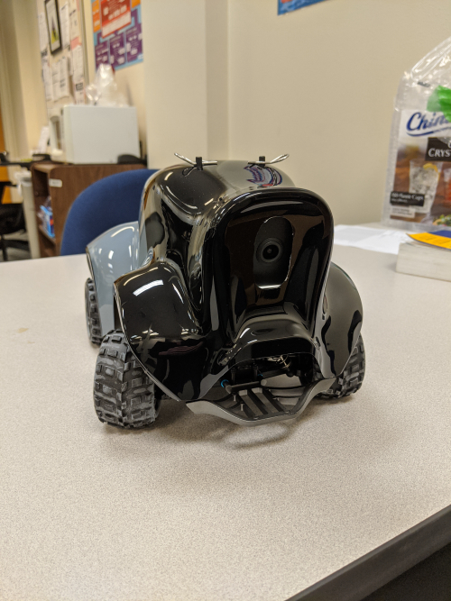
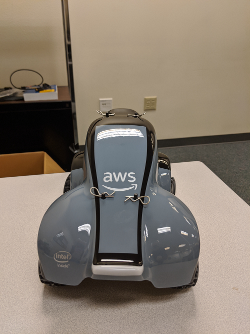

# Self Driving Car
In our effort to build self-driving cars as a fun project we
started with the [DonkeyCar project](https://www.donkeycar.com/).
This involved purchasing parts and 3D printing a chasis. While it was
accomplished we wanted something to focus on the software.
Now we have purchased and received an Amazon DeepRacer.

# What is DeepRacer
DeepRacer is a car built by Amazon that uses reinforcement learning
to drive around a race track, at least that it the goal. They have
a simulator and a racing league.
See the [DeepRacer website](https://aws.amazon.com/deepracer/)

# DeepRacer Developer Guide
Link for the Developer Guide as per Amazon.com
[DeepRacer Developer Guide](https://docs.aws.amazon.com/deepracer/latest/developerguide/what-is-deepracer.html)

## Setup Instructions
See the [Setup Page](Setup.md)

  

# AWS DeepRacer Photos

